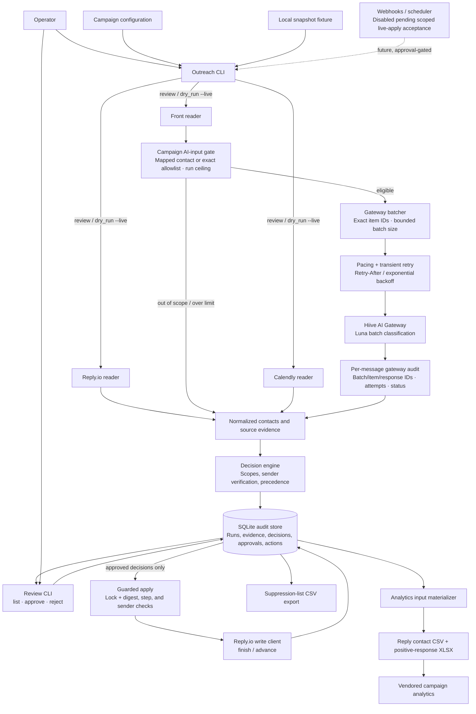

# Email Outreach Workflow

Local-first campaign outreach orchestration. It supports source snapshots, SQLite-backed review, and a guarded Reply.io apply path. Live writes occur only for explicitly approved, non-stale decisions.

## Architecture



The only vendor-write path is `Guarded apply`; live review, exports, and analytics materialization are read-only.

## Local setup

Use Python 3.9 or newer. No third-party Python package is required for the current local workflow.

```sh
PYTHONPATH=src python3 -m unittest discover -s tests -v
```

The first command creates `data/outreach.db` and applies SQL migrations from `migrations/`. The database is local-only and ignored by Git.

## Hiive AI Gateway setup

Copy `.env.example` to `.env` and provide a configured model plus **one** Cloudflare Access method. The classifier never needs an OpenAI, Anthropic, Google, or other model-provider API key.

For local development, authenticate with Cloudflare and supply a short-lived access token:

```sh
cloudflared access login https://ai-gateway.hiive.network
cloudflared access token -app=https://ai-gateway.hiive.network
```

Set `CF_ACCESS_TOKEN` to the token command's output and set `AI_GATEWAY_MODEL` in `.env`. Do not use a generic Cloudflare API token or a model-provider API key. For the container or future scheduled runner, use `CF_ACCESS_CLIENT_ID` and `CF_ACCESS_CLIENT_SECRET` instead. Before enabling a real campaign, run the read-only check:

```sh
PYTHONPATH=src python3 -m outreach gateway check
```

It calls only `GET https://ai-gateway.hiive.network/compat/models` and returns safe diagnostics such as HTTP status, Cloudflare Ray ID, and allowlisted AI Gateway error metadata; it never prints tokens or arbitrary response bodies.

The client validates models and structured reply classifications before a live review run. No model-provider API key is needed.

Eligible Front messages are classified in bounded batches rather than one completion per message. The default runtime settings are:

- `AI_GATEWAY_BATCH_SIZE=10`: at most ten messages in one completion; valid range 1–50.
- `AI_GATEWAY_BATCH_PAUSE_SECONDS=1`: delay between batches; valid range 0–60 seconds.
- `AI_GATEWAY_MAX_ATTEMPTS=3`: total attempts for a transient or invalid-model response; valid range 1–10.
- `AI_GATEWAY_RETRY_BASE_SECONDS=1` and `AI_GATEWAY_RETRY_MAX_SECONDS=30`: bounded exponential backoff. An HTTP `Retry-After` value takes precedence, capped at the configured maximum.

Network failures, timeouts, invalid JSON/model output, HTTP 408/409/425/429, and HTTP 5xx responses are retried. Permanent request, authentication, and route errors are not retried. Every batch response must contain exactly one valid result for each opaque item ID; partial, duplicate, missing, or unknown IDs invalidate and retry the whole batch. After the final failed attempt, every message in that batch is retained as review-only `unclear` evidence.

Each persisted Front evidence row includes sanitized gateway audit metadata: local batch and item IDs, batch size, gateway response ID, model, attempt count, success/failure status, and bounded HTTP/Cloudflare diagnostics when present. Raw Front message bodies and credentials remain excluded from SQLite and generated artifacts.

### Gateway input boundary

Inbox membership alone does not authorize sending a message body to the AI gateway. A Front message is eligible only when its author matches a Reply contact in the current campaign or the campaign configuration explicitly allowlists its exact author email, Front conversation ID, or Front message ID. Wildcards are forbidden. The safe default has no unmapped allowlists.

Each campaign also sets `maxMessagesPerRun`. When the number of eligible messages exceeds that ceiling, the application sends no partial batch; all otherwise eligible messages are retained as `unclear` evidence with `gateway_status=skipped_run_limit`. Messages that are neither mapped nor allowlisted are retained with `gateway_status=skipped_scope` and are never sent to the gateway.

```json
"classification": {
  "confidenceThreshold": 0.8,
  "gatewayInputScope": {
    "allowedUnmappedEmails": [],
    "allowedFrontConversationIds": [],
    "allowedFrontMessageIds": [],
    "maxMessagesPerRun": 25
  }
}
```

Use an exact conversation or message ID for a forwarded email whenever possible. Historical bounceback corpora should remain in the separate offline evaluation workflow unless individual messages are deliberately approved here.

## Live local review workflow

The `--live` source reads Reply.io, Front, Calendly, and the Hiive AI Gateway, then writes decisions to SQLite. It never mutates Reply.io. `apply` is a separate, approval-gated command.

1. Copy `.env.example` to `.env` and add the required credentials.
2. Replace `config/campaigns/example-campaign.json` with a real campaign definition: Reply campaign ID, expected sender for each active step, Front inbox IDs, Calendly reporting window/event types, and the two suppression scopes.
3. Authenticate `cloudflared`; use the default `openai/gpt-5.6-luna` model after confirming it appears in the Hiive gateway catalog.
4. Run a local review:

```sh
PYTHONPATH=src python3 -m outreach run \
  --campaign <campaign-slug> \
  --mode review \
  --live
```

Before a live acceptance run, copy `config/campaigns/test-campaign.local.json.example` to a `.local.json` file, replace every placeholder with the scoped non-production campaign values, then run the non-secret readiness check:

```sh
PYTHONPATH=src python3 -m outreach preflight --campaign <test-campaign-slug>
```

For the complete non-production workflow—from Front inbox discovery and configuration through the exactly-once apply and analytics reconciliation—follow the [end-to-end operating procedure](docs/END_TO_END_OPERATING_PROCEDURE.md).

The command exits non-zero until the campaign, Front/Calendly scope, AI model, and required credentials are all present. It never prints secret values.

The run validates the configured AI model before reading classifications. It stores vendor IDs, normalized identity/sender evidence, and classification metadata in `data/outreach.db`; it does not store raw Front email bodies.

### Front inbox boundary

Each live campaign may configure exactly one Front inbox. Configuration must repeat that ID in `front.confirmedInboxId` and include a non-empty `front.confirmation` acknowledgement. The reader lists conversations through that inbox, rechecks each conversation's inbox membership before fetching its messages, and records the confirmed inbox ID with every Front evidence row. The credential may still technically access other inboxes in its workspace, but this workflow refuses to process or act on them.

## Try the local workflow

The included campaign configuration and snapshot are safe fixtures; they do not call Reply.io, Front, Calendly, or an AI provider.

```sh
PYTHONPATH=src python3 -m outreach run \
  --campaign example-campaign \
  --mode dry_run \
  --snapshot fixtures/example_snapshot.json

PYTHONPATH=src python3 -m outreach run \
  --campaign example-campaign \
  --mode review \
  --snapshot fixtures/example_snapshot.json

PYTHONPATH=src python3 -m outreach review list --campaign example-campaign
PYTHONPATH=src python3 -m outreach review approve <decision-id> \
  --reviewer "Nicole" --note "Verified meeting"
```

After reviewing and explicitly approving a decision, `apply` rechecks the campaign digest, Reply sequence step, and sending account before it writes. It uses a campaign lock and durable action records, so rerunning it does not repeat a successful write:

```sh
PYTHONPATH=src python3 -m outreach run --campaign example-campaign --mode apply
```

Use exports only as audit/reporting aids; they cannot authorize a Reply action:

```sh
PYTHONPATH=src python3 -m outreach export suppression-list --campaign example-campaign
PYTHONPATH=src python3 -m outreach export analytics-inputs --campaign example-campaign
```

The analytics export creates the vendored reporting contract under `vendor/email-campaign-analysis/campaigns/<slug>/`: a Reply.io contact CSV, a generated `positive_response_generated.xlsx`, and an empty issuer-override file if needed. For local workbook creation, set `ARTIFACT_TOOL_NODE_BIN` and `ARTIFACT_TOOL_NODE_MODULES` to a packaged artifact-tool runtime. The current container does not package that runtime, so analytics export is intentionally unavailable inside it.

## Repository layout

- `src/outreach/`: orchestration, campaign config validation, decision engine, SQLite persistence, and CLI.
- `migrations/`: versioned SQLite schema migrations.
- `config/campaigns/`: versioned campaign definitions; configuration never contains credentials.
- `vendor/reply-io-email-sender/`: merged source snapshot for the Reply.io sender/step-action module.
- `vendor/email-campaign-analysis/`: merged source snapshot for the analytics module.
- `fixtures/`: safe local data used by tests and CLI demonstrations.

See [docs/BUILD_PLAN.md](docs/BUILD_PLAN.md) for the full staged architecture and local-first rollout plan.

Before connecting a real campaign, follow [docs/TEST_PLAN.md](docs/TEST_PLAN.md). It defines the required fixture, adapter, gateway, review, and tightly scoped apply gates.

## Phase 2: repeatable local container

The project includes a single local container definition for the Python workflow and the imported Node runtime. Install Docker Desktop before using it; Docker is not installed in the current development environment.

```sh
docker compose build
./scripts/local-container.sh run \
  --campaign example-campaign \
  --mode review \
  --snapshot /app/fixtures/example_snapshot.json
```

`data/` and `artifacts/` are mounted from the host and persist between runs. Campaign definitions and fixtures are mounted read-only. A local `.env` may supply credentials later; it is optional and is never copied into the image.

The imported analytics scripts use `@oai/artifact-tool`, which is not yet packaged in this container. Analytics export remains disabled in the container until that dependency is supplied. Webhooks and scheduled execution are also intentionally disabled until the local live-apply acceptance gate passes.
