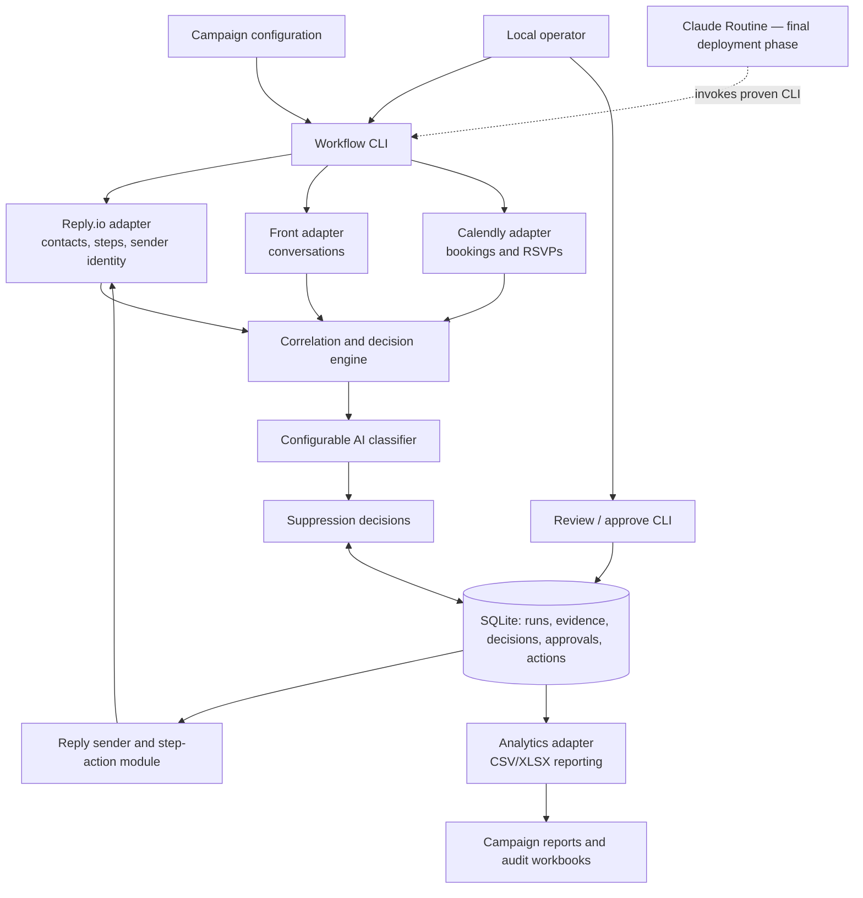

# Campaign-Aware Email Outreach Workflow — Build Plan

## Goal

Build a local-first, campaign-configured application that combines Reply.io campaign state, Front conversations, and Calendly bookings to decide whether each contact should be finished, advanced, held for review, or left unchanged. The service will use a configurable low-cost AI gateway to classify email replies and will produce campaign analytics.

The system must respect opt-outs and other suppression rules, verify the email sender for every sequence step, provide an audit trail for every decision, and avoid duplicate Reply.io actions.

## Architecture

### Consolidated codebase

Merge the existing repositories into this project and make it the sole build and deployment unit:

- Port `reply.io-email-sender` Python modules into `src/outreach/reply/`; preserve its Reply client, sequence-shape validation, sender validation, step movement, and audit-workbook behavior.
- Port `email-campaign-analysis` reporting scripts and templates into `analytics/`; keep Node-based workbook generation and Calendly reports behind an internal analytics adapter.
- Add the orchestration, configuration, SQLite persistence, CLI, Front, Calendly, and AI adapters under `src/outreach/`.
- Keep vendor credentials, generated analytics, local databases, and temporary exports out of Git.

### Components

- **Campaign configuration**: versioned YAML or JSON files, one per campaign.
- **Local workflow CLI**: an idempotent command that supports `dry_run`, `review`, and `apply` modes.
- **Source adapters**: Reply.io, Front, Calendly, AI gateway, sequence-action implementation, and analytics integration.
- **Decision engine**: applies deterministic signals and campaign suppression rules before AI classifications.
- **SQLite review queue**: retains low-confidence classifications, identity conflicts, and sender-attribution mismatches for operator approval.
- **Persistence/audit store**: a local SQLite database recording runs, source evidence, decisions, approvals, and external actions.

### Architecture



### Operational flow

1. A local operator invokes one CLI entrypoint with a campaign ID and execution mode: `dry_run`, `review`, or `apply`.
2. The job loads and validates the campaign configuration.
3. Reply.io data is synchronized for campaign contacts, sequence state, sends, replies, step numbers, and sender identities.
4. Front conversations and Calendly events are retrieved, normalized, and linked to Reply contacts. Inbox membership creates local evidence but does not by itself authorize gateway transmission.
5. Sender attribution is verified against the configured sender for the applicable Reply sequence step.
6. Before AI classification, require a mapped Reply contact or an exact campaign allowlist for the Front author, conversation, or message. If the eligible set exceeds the campaign run ceiling, send none. Otherwise classify the bounded batches through the AI gateway.
7. The decision engine produces an auditable proposed action for every affected contact.
8. High-confidence and deterministic actions are passed to the merged Reply sequence-control module; held items await operator approval in SQLite.
9. On campaign completion, or on demand, the job materializes analytics inputs and runs the analytics integration.
10. The CLI writes a summary of synchronized records, proposed/applied actions, review items, failures, and analytics artifacts. Claude Routine is added only after this local flow is stable.

## Campaign configuration

Each campaign configuration must include:

- `campaignId`: Reply.io campaign identifier.
- `slug`: analytics campaign slug; maps to `campaigns/<slug>/` in the analytics repository.
- `schedule`: Claude Routine schedule and permitted execution mode.
- `front`: mailbox/team scope and matching constraints.
- `calendly`: event filters, booking-link metadata, and campaign start timestamp.
- `sequenceSteps`: Reply sequence step identifier/order, expected sender email/account, permitted sender aliases, and step-specific action rules.
- `suppressionPolicy`: the campaign's allowed sources and handling rules for its two suppression scopes: `exact_contact` and `domain_company`.
- `classification`: permitted labels, confidence threshold, and fallback behavior.
- `positiveResponseDefinition`: user-selected outcome types that count as a positive response for this campaign. Supported initial values are `reply_received`, `meeting_booked`, and `event_rsvp`; the definition may include one or more values.
- `analytics`: issuer-alias override location, source-export mapping, and final-report trigger.
- `notifications`: recipients and failure/review escalation settings.

Validate configuration before syncing: campaign IDs, sender identities, sequence-step mappings, booking-link UTM parameters, and rule references must resolve. Invalid configuration blocks the run before it changes Reply.io.

## Data correlation and sender verification

1. Prefer vendor-specific identifiers to match data across systems.
2. Fall back to normalized contact email only when identifiers are unavailable.
3. Attach Reply sequence, step, sending account/email, and send timestamp to every reply candidate.
4. Treat a Front reply as attributable only when it matches the recipient and the expected sender for the relevant sequence step (or an explicitly configured alias).
5. Route missing senders, sender conflicts, multiple possible contacts, and unresolved matches to review; never automatically update those contacts.
6. Record the matching method and all source evidence with the final decision.

## Suppression and classification

### Campaign-configured suppression model

Each campaign has exactly two suppression types. A rule's source may be a Front outcome, a Calendly booking, an event RSVP, an operator decision, or a configured import; its scope is determined by the campaign configuration.

| Type | Match key | Effect |
| --- | --- | --- |
| `exact_contact` | Normalized email address | Finish and exclude only that matching Reply contact from future steps. It does not affect colleagues at the same company. |
| `domain_company` | Normalized email domain, including configured subdomains, or an explicitly configured company/issuer identifier | Finish and exclude every matching active contact in the campaign. |

The campaign configuration must declare which source outcomes create each type. For example, a campaign may treat a booked meeting as an `exact_contact` suppression and an event RSVP as a `domain_company` suppression, or make either outcome report-only. Unmatched, conflicting, or ambiguous company/domain evidence is held for review.

The workflow records the type, match key, source evidence, matched contacts, and applied Reply action. It does not infer issuer-wide suppression from a contact reply unless the campaign explicitly maps that outcome to a `domain_company` rule.

### Decision precedence

1. Legal and contact-protection signals: unsubscribe, do-not-contact, and explicit removal requests.
2. Deterministic external outcomes: booked meeting and configured Calendly status.
3. Explicit Front/Reply reply content or manually approved outcome.
4. Campaign-configured exact-contact or domain/company suppression rules.
5. Valid high-confidence AI classification.
6. Default configured sequence behavior.

### Hiive AI Gateway integration

Use the [Hiive AI Gateway](https://ai-gateway.hiive.network/) as the initial `ClassifierClient`. It is a Cloudflare Zero Trust-protected, OpenAI-compatible proxy at `https://ai-gateway.hiive.network/compat`; it authenticates and bills upstream model providers, so the workflow must not store provider API keys.

- Local developers authenticate with `cloudflared access login https://ai-gateway.hiive.network` and a short-lived `cf-access-token`.
- Containers and future Claude Routine runs use one dedicated Cloudflare Access service token stored only in managed secrets: `CF_ACCESS_CLIENT_ID` and `CF_ACCESS_CLIENT_SECRET`. Send them using `CF-Access-Client-Id` and `CF-Access-Client-Secret` headers.
- Do not send `Authorization`, `x-api-key`, or provider API-key headers.
- Configure `AI_GATEWAY_BASE_URL=https://ai-gateway.hiive.network/compat` and `AI_GATEWAY_MODEL=openai/gpt-5.6-luna` outside campaign configuration. Before reading vendor data, call `GET /compat/models` using Cloudflare Access credentials and fail the run if the configured model is absent.
- Send bounded multi-message classifications to `POST /compat/chat/completions` using the OpenAI-compatible request format. Correlate every result through an opaque item ID and reject a partial, duplicate, missing, or unknown result set. Pace batches and use bounded `Retry-After`/exponential backoff for transient failures. All model traffic must use the Hiive gateway host; provider-direct base URLs are rejected.
- Treat each campaign's `classification.gatewayInputScope` as an independent data-egress boundary. Default to mapped Reply contacts only; permit unmapped mail solely through exact author, Front conversation, or message IDs. Forbid wildcards and fail the entire eligible set closed when `maxMessagesPerRun` is exceeded.

The client accepts minimal campaign/reply context and returns validated structured data:

- label: `interested`, `not_interested`, `referral`, `objection`, `out_of_office`, `unsubscribe`, `booked_meeting`, or `unclear`
- confidence: numeric confidence score
- rationale: brief non-sensitive explanation
- optional referred contact details

Low-confidence, malformed, contradictory, unavailable-model, timeout, or access-failure results remain in `hold_for_review`. Retain per-message batch/item/response identifiers, batch size, gateway model, attempts, status, classification result/confidence, bounded error diagnostics, and input-content references—not secrets or copied email contents.

## Local SQLite review workflow

Create `data/outreach.db` automatically on first local run. Use Python `sqlite3` with ordered SQL migrations committed under `migrations/`; record the applied migration version in the database before processing campaign data.

The initial schema includes:

- `campaign_runs`: campaign slug, configuration version, mode, timestamps, status, and summary counts.
- `contacts`: normalized Reply contact identity, sequence step, and sender context.
- `source_evidence`: Reply, Front, Calendly, RSVP, and classifier evidence references linked to a run and contact.
- `suppression_decisions`: proposed scope, match key, reason, action, classifier result/confidence, status, and idempotency key.
- `approvals`: decision ID, reviewer, approved/rejected result, timestamp, and note.
- `reply_actions`: approved decision ID, requested Reply action, request time, vendor response, and final status.

`suppression_decisions` is the approval source of truth. CSV/XLSX exports are read-only review aids and cannot authorize an action.

Local commands must support:

```sh
python -m outreach run --campaign <slug> --mode dry_run
python -m outreach run --campaign <slug> --mode review
python -m outreach review list --campaign <slug>
python -m outreach review approve <decision-id> --reviewer <name> --note <note>
python -m outreach review reject <decision-id> --reviewer <name> --note <note>
python -m outreach run --campaign <slug> --mode apply
```

`apply` processes only approved decisions from the applicable completed review run. It must reject stale decisions when campaign configuration, Reply sequence state, expected sender, or match evidence has changed since review.

## Reply.io action handling

- Reuse the merged Reply sequence-control modules for sender verification, eligibility checks, step movement, and audit workbooks.
- Adapt its current issuer-level blocker logic to consume the campaign's two suppression types: exact-contact suppression must finish/exclude only the matching contact, while domain/company suppression must finish all matched contacts. Do not use `PCS Issuer ID` as an implicit suppression scope.
- Retain `PCS Issuer ID` as a required analytics/correlation field where the configured campaign requires it, but do not make missing issuer data a universal blocker for exact-contact suppression.
- Send only approved actions with a stable decision ID/idempotency key.
- Persist request, response, timestamp, action result, and prior Reply state.
- Lock work per campaign and time window so overlapping Claude Routine executions cannot apply an action twice.
- Retry transient vendor failures with bounded backoff; do not retry invalid actions without review.

## Analytics integration: merged `email-campaign-analysis` modules

The existing analytics repository is merged into this application as the reporting contract; its supported transformations, templates, and metric definitions must be retained rather than recreated.

### Repository contract

For every campaign slug, the analytics project expects:

```
campaigns/<campaign-slug>/input/
campaigns/<campaign-slug>/config/issuer-overrides.json
campaigns/<campaign-slug>/output/
```

Required inputs are:

- `input/Reply.io_Contact_Report.csv`, containing at minimum: `Contact Id`, `PCS Issuer ID`, `Contact email`, `Sequence`, `Sequence step`, `Delivered`, `Opened`, `Clicked`, `Replied`, and `OptedOut`.
- A generated positive-response workbook named `positive_response*.xlsx`, with a `Positive Responses` worksheet. The workflow builds this workbook from the campaign's `positiveResponseDefinition`; it is not a manually maintained source of truth.
- Campaign-specific issuer aliases in `config/issuer-overrides.json`.
- Git-ignored `booking-links.json`, defining campaign `id`, `name`, `reportStart`, sequences, and Calendly booking links carrying UTM parameters.
- Git-ignored `.env` values for `CALENDLY_ACCESS_TOKEN` and `CALENDLY_ORGANIZATION_URI`.

The workflow must materialize compatible exports from its normalized data. It generates the positive-response workbook using only the outcomes selected by the user for that campaign:

- `reply_received`: a verified campaign reply in Front or Reply.io.
- `meeting_booked`: a matching Calendly booking.
- `event_rsvp`: a verified RSVP to the configured campaign event.

Every generated row must retain its source, outcome type, contact identity, sender, sequence/version, and supporting evidence. The analytics adapter maps these rows into the existing workbook schema and preserves its issuer × sender × version deduplication behavior. This campaign definition controls the positive-response metric; it does not change suppression-rule precedence or the independent meeting-booked reporting.

### Existing reporting commands and outputs

Run the repository's supported commands for `<campaign-slug>`:

```sh
node scripts/refresh_campaign_analysis.mjs <campaign-slug>
node scripts/report_calendly_meetings.mjs <campaign-slug>
```

The integration must retain and publish these outputs:

- `output/campaign_analysis.xlsx`
- `output/contact_breakdown.csv`
- `output/issuer_breakdown.csv`
- `output/calendly-meeting-summary.csv`
- `output/calendly-meeting-details.csv`

The existing dashboard reports delivery, reply, positive-response, meeting-request, and meeting-booked performance, including comparisons by sender, A/B version, and stop step. Extend the workflow's audit/export layer with verified sender, suppression decision, classifier label/confidence, and review status without altering those established metric definitions.

## Deployment and operations

- **Phase 1 — local stability:** run the CLI against a test campaign in `dry_run`, then `review`, and finally a tightly scoped approved `apply`. Verify SQLite records, Reply audit workbooks, and analytics reconciliation.
- **Live local review implementation:** use the CLI's explicit `--live` mode to read Reply campaign contacts and sender assignment, Front inbound replies, Calendly invitees, and Hiive classifications into SQLite. This mode is read-only and retains vendor evidence IDs rather than raw reply bodies.
- **AI gateway validation:** after fixture tests pass, authenticate a local developer with Cloudflare Access, validate `GET /compat/models`, and run a non-sensitive real-gateway classification test with `openai/gpt-5.6-luna`. Do not enable a real campaign until the structured response and SQLite audit record are verified.
- **Phase 2 — repeatable local release:** package the merged Python and Node runtimes in one container, retaining the same CLI contract and mounting persistent storage for `outreach.db`, campaign configuration, and generated reports. The initial container runs the tested Python CLI; analytics remains disabled until the imported `@oai/artifact-tool` dependency is supplied through a production-compatible package or the analytics adapter is replaced.
- **Phase 3 — Claude Routine:** only after the local acceptance criteria pass, configure Claude Routine to invoke the proven container command on each campaign's schedule. The routine returns the run summary and never bypasses the SQLite approval requirement.
- Before a scheduled `apply`, the runner checks for an approved, non-stale review decision set. Scheduled runs with no approved actions can sync and create review items but cannot modify Reply.io.
- Store Reply.io, Front, Calendly, AI gateway, database, and deployment credentials only in managed secrets.
- Pagination, gateway batching/pacing, rate-limit handling, and bounded gateway retry/backoff are implemented for live local review. Before scheduled operation, add structured logs, durable run status, metrics, and alerts for failed runs or growing review queues.
- Retain a manual invocation path using the same container command for backfills, troubleshooting, and end-of-campaign reporting.

## Test and acceptance plan

- Unit tests: config validation, email normalization, sender verification, identity matching, rule precedence, classifier schema validation, and idempotency.
- Gateway tests: user-token and service-token access; configured model discovery; mapped-or-exactly-allowlisted input scope; atomic run ceilings; successful and malformed batch completions; exact item-ID correlation; pacing; transient retry/backoff and `Retry-After`; permanent errors; low confidence; and confirmation that unrelated inbox bodies, secrets, and raw bodies never enter gateway requests, logs, SQLite, campaign config, or reports.
- Database tests: run migrations against an empty SQLite database; verify approval state transitions, reviewer audit data, stale-decision rejection, and exactly-once Reply action recording.
- Adapter integration tests: Reply.io, Front, Calendly, AI gateway, sequence-control implementation, and analytics export materialization.
- Scenario tests: unsubscribe, explicit disinterest, interest, out-of-office, referral, booked/cancelled meeting, sender mismatch, duplicate contact, ambiguous match, conflicting signals, low confidence, API failure, and duplicate scheduler invocation.
- Analytics reconciliation: verify materialized inputs and outputs against the existing analytics repository for a known campaign.
- Local acceptance: a dry run produces a complete auditable decision set; approvals are stored in SQLite; approved actions are applied exactly once; and analytics artifacts reconcile with campaign source data and include sender/step attribution.
- Scheduled acceptance: enable Claude Routine only after local acceptance passes on the first campaign; verify it invokes the identical container command, cannot apply unapproved/stale decisions, and reports failures and review backlog.

## Required inputs before implementation

- Reply.io campaign ID for the first campaign.
- The two existing repositories will be merged into this project while preserving their current behavior and reporting contracts.
- Front mailbox/team scope and API credentials.
- Calendly organization credentials and booking-link metadata.
- Cloudflare Zero Trust access for local developers, plus a dedicated service token for the container/scheduled runner once local gateway validation succeeds.
- Claude Routine deployment target, schedule, persistent database/report storage, and required notification channel (required only after local acceptance).
